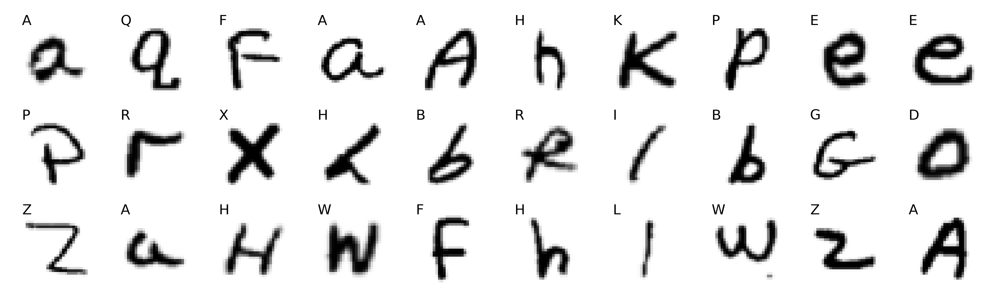

# Predicting Handwritten Letters in "Corrupted" Images

## Background (`notebooks/background.ipynb`)
The goal of this project is to predict handwritten letters on images with noise
similar to traditional [CAPTCHA](https://en.wikipedia.org/wiki/CAPTCHA)
images. The training data is from the
[EMNIST](https://www.nist.gov/itl/products-and-services/emnist-dataset), a
balanced dataset of handwritten lowercase and uppercase letters from the Latin
alphabet. The total size of the training data is 124,800 images, with each
letter represented 4,800 times. Images are represented as arrays with grayscale
pixel values ranging from 0 (white) to 255 (black).

Figure 2: Random examples of handwritten letters.

## Training the CNN (`notebooks/train_cnn`)

A CNN is a special design of neural network for processing data that has a
grid-like structure, like images that can be represented as a grid of pixels.
CNN takes its name from the mathematical linear operation between matrices
called convolution (Albawi et al., 2017). A survey by Baldominos et al. (2019)
characterizes CNNs as the state-of-the-art approach of solving handwritten character recognition problems.

The architecture of the CNN model consists of seven layers: four
convolutional and three fully-connected (dense) layers. The first layer uses a
filter of 64 and a 5x5 kernel with strides of 2x2,  the second layers a filter
of 32 and a 2x2 kernel with strides of 1x1. The sub-sampling method I employ is
*maxpooling*, for regularization I include dropout layers. The third and fourth
layers have the same architecture asthe first and second layers. The two dense
layers that follow to convolutional layers consist of 128 units, thefinal dense
layer embodies 26 units (the number of classes) and has a Softmax activation
function.

The trained CNN model achieves a test accuracy of 95.06%.

Figure 2: Random examples of misclassified letters. (prediction in blue)

## Denoising Images (`notebooks/predicting_images`)

*Step 1: Removing the noise*

To remove the pepper noise from the image, I apply a Gaussian blur and create a
threshold that masks the original image. This approachis relatively successful
in most cases.

|                       Original image                        |                       Denoised image                        |
| :---------------------------------------------------------: | :---------------------------------------------------------: |
|  |  |

*Step 2: Separating contours*

The biggest challenge is to separate the four individual letters in the image.
Some images have sufficient white space between letters so that it is easy to
find the four contours. Others have connected or even overlapping letters that result in fewer identifiable contours in the denoised image. 

*Step 3: Cleaning images*

The images that result from the contour identifications are then cleaned to
ensure that there are four images withthe required dimensions. This step
involves the splitting, padding, and normalization of images. The outcome is a
set of four images that - in most cases - look similar to the images that the
CNN was trained on.

|                       Seperated images                       |                       Cleaned images                       |
| :----------------------------------------------------------: | :--------------------------------------------------------: |
|  |  |

*Step 4: Predicting images*
I then let the CNN predict the four images. I consider the five most probable
predictions by the model. The correct label is among the top five predictions
for 68.0% of the "corrupted" images.

## References
Gregory  Cohen,  Saeed  Afshar,  Jonathan  Tapson,  and  Andre  Van  Schaik.
Emnist:  Extending  mnist  tohandwritten letters. In *2017 International Joint
Conference on Neural Networks (IJCNN)*. IEEE, 2017.

Saad Albawi, Tareq Abed Mohammed, and Saad Al-Zawi.  Understanding of a
convolutional neural net-work. In *2017 International Conference on Engineering
and Technology (ICET)*, 2017.

Alejandro Baldominos, Yago Saez, and Pedro Isasi.  A survey of handwritten
character recognition withmnist and emnist. *Applied Sciences*, 9(15), 2019.5
